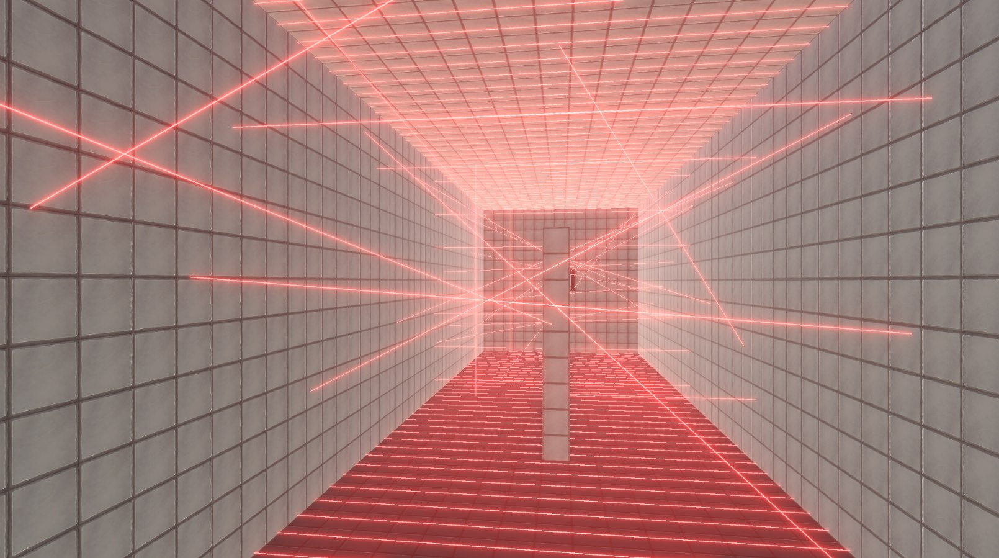

# Симулятор летающего дивана

## Описание проекта

Проект представляет собой игру, в которой пользователь попытается протестировать летающий диван - последнее слово техники. В этом ему посодействует голосовой помощник.
В рамках игры существует 5 комнат с испытаниями. В каждой из них предусмотрено сохранение на случай, если случится проигрыш.

Проиграть возможно, если:

* Удариться об стену на слишком большой скорости
  
* Коснуться лазера
  
* Попасть под "плющилку" - огромный пресс.

Игра предназначена для VR очков Oculus Quest 2, а также капсулы на подвижной платформе Futurift v2.

Управление в игре осуществляется с помощью геймпада:
* Левый стик - перемещение влево, вправо, вперёд и назад
* Правый стик - перемещение вверх и вних
* L2 - поворот вокруг своей оси влево
* R2 - поворот вокруг своей оси вправо
* "R" на клавиатуре - запуск игры/возврат в меню

## Технологии

* **Движок:** Unity 2023.2.3f1
* **Язык программирования:** C#
* **Система контроля версий:** Git

## Скриншоты

## Геймплей

